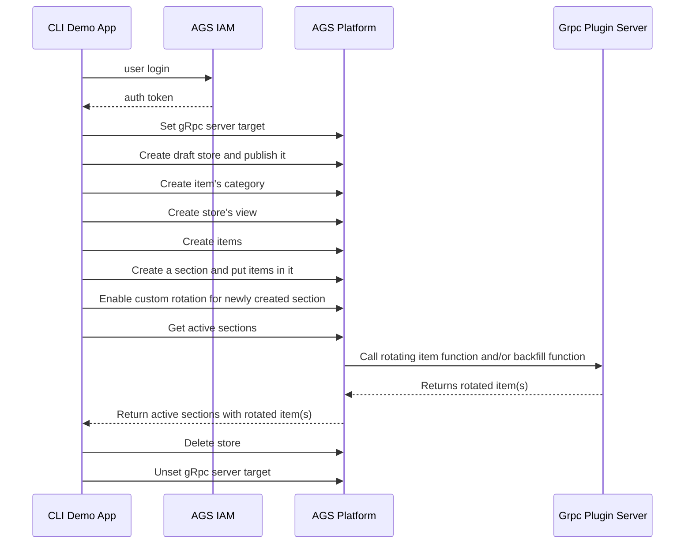

# Platform Service's Custom Item Rotation Plugin gRPC Demo App

A CLI demo app to prepare required data and execute Custom Item Rotation Plugin gRPC for AGS's Platform Service.
Following diagram will explain how this CLI demo app works.


## Prerequsites

* .net 6 sdk

## Usage

### Setup

The following environment variables are used by this CLI demo app.
```
export AB_BASE_URL='https://demo.accelbyte.io'
export AB_CLIENT_ID='xxxxxxxxxx'
export AB_CLIENT_SECRET='xxxxxxxxxx'

export AB_NAMESPACE='namespace'
export AB_USERNAME='USERNAME'
export AB_PASSWORD='PASSWORD'
```
If these variables aren't provided, you'll need to supply the required values via command line arguments.

Also, you will need `Custom Rotating Shop Items Plugin gRPC` server already deployed and accessible. If you want to use your local development environment, you can use tunneling service like `ngrok` to tunnel your grpc server port so it can be accessed by AGS.
> Current AGS deployment does not support mTLS and authorization for custom grpc plugin. Make sure you disable mTls and authorization in your deployed Grpc server.


### Example
CLI demo app requires only the grpc server url as a parameter. By default, cli app will execute custom item rotation demo. If you want to execute custom backfill function you can add `--run-mode backfill` option.

- Without any environment variables
```bash
$ dotnet run -- --baseurl https://demo.accelbyte.io --client <CLIENT-ID-VALUE> --secret <CLIENT-SECRET-VALUE> --namespace <NAMESPACE-VALUE> --username <USERNAME> --password <PASSWORD> --grpc-target <GRPC_PLUGIN_SERVER_URL>
```

- With basic environment variables setup
```bash
$ dotnet run -- --username <USERNAME> --password <PASSWORD> --namespace <NAMESPACE-VALUE> --grpc-target <GRPC_PLUGIN_SERVER_URL>
```

- With all environment variables setup
```bash
$ dotnet run -- --grpc-target <GRPC_PLUGIN_SERVER_URL>
```

- With all environment variables setup and using extend app instead of grpc target
```bash
$ dotnet run -- --extend-app <EXTEND_APP_NAME>
```

- With all environment variables setup and use custom store category path (category path must be prefixed by `/`)
```bash
$ dotnet run -- --category <CATEGORY_PATH> --grpc-target <GRPC_PLUGIN_SERVER_URL>
```

- Show usage help
```bash
 $ dotnet run -- --help
```

## Build

To build this CLI sample app, execute the following command.

```bash
$ dotnet build
```